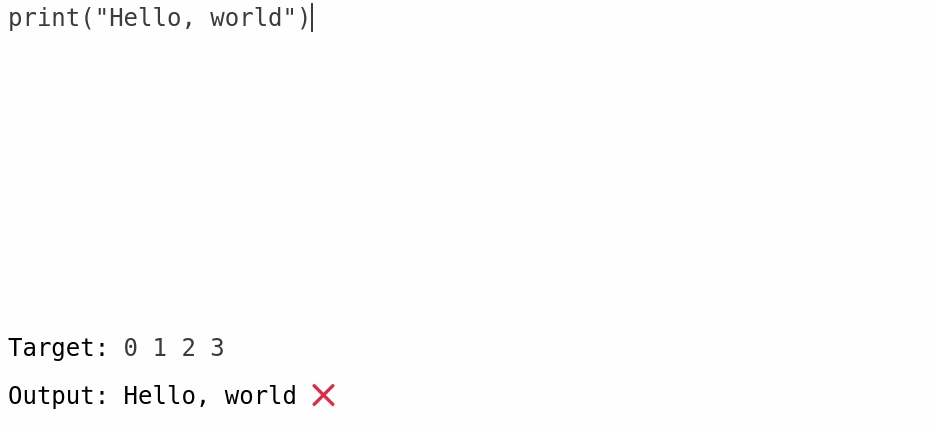

# Codeslide

Interactive code slides for educational presentations.

Codeslide provides a way to create a live coding excercise quickly and easily on a single presentation slide. This software runs 100% locally in the browser.

[Example presentation](https://jncraton.github.io/codeslide/examples/iteration.html)

[Live slide creation](https://jncraton.github.io/codeslide/#WyJ7RWRpdGFibGUgY29kZX0iLCJ7RWRpdGFibGUgdGFyZ2V0fSJd)

Note that this software is alpha quality and URLs may break and APIs may change at any time. If you intend to use this software, it is recommended that you run it locally.
